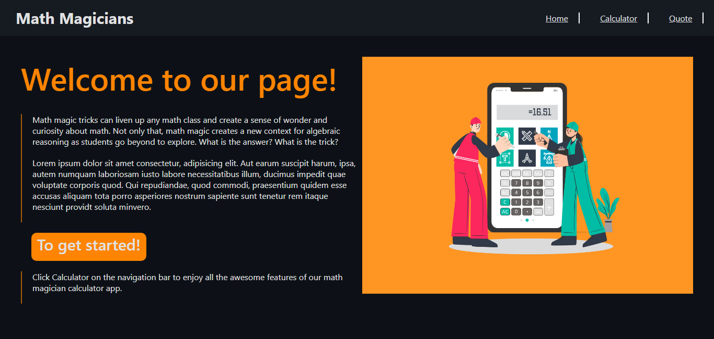
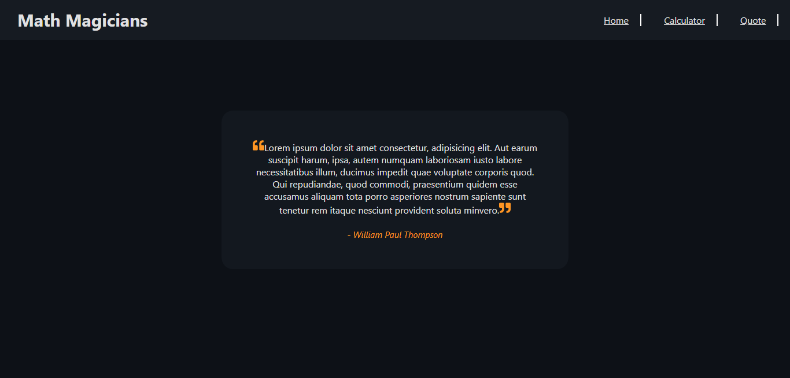

# Math-Magicians

This is a Single Page App (SPA) that allows users to make simple calculations and read a random math-related quotes. The aim of this project is to learn how to use React.

> Math-magicians: started of by building the core functionality, which is a calculator that contains a simple UI and is able to perform all math operations. Then created a full functional website for the Math magicians app, consisting of three pages using React Router.

## Overview

### Screenshots





## Live Demo

[link to live demo on Heroku](https://math-magicians-fave.herokuapp.com/)
[link to live demo on Netlify](https://favour-math-magicians.netlify.app/)

## Built With

- Create React App (CRA)
- React Router
- Gitflow

## Getting Started

### Clone this repository

```bash
$ git clone git@github.com:Favourezeugwa/math-magicians.git
$ cd math-magicians
```

### Run project

```bash
$ npm install
$ npm start
```

### Open page in browser

```bash
$ http://localhost:3001/
```

## Author

👤 **Favour Amarachi Ezeugwa**

- GitHub: [@Favourezeugwa](https://github.com/Favourezeugwa)
- LinkedIn: [Favour Amarachi Ezeugwa](https://www.linkedin.com/in/favour-amarachi-ezeugwa-a5bb31149/)
- Twitter:[@Favour_ezeugwa](https://twitter.com/Favour_ezeugwa)

## Contributor

👤 **Felix Ouma**

| 👤 Name    | Github                                 | Twitter                                           | LinkedIn                                                     |
| ---------- | -------------------------------------- | ------------------------------------------------- | ------------------------------------------------------------ |
| Felix Ouma | [@Felix45](https://github.com/Felix45) | [@Felix_Atonoh](https://twitter.com/Felix_Atonoh) | [LinkedIn](https://www.linkedin.com/in/felix-ouma-639766b0/) |

## 🤝 Contributing

Contributions, issues, and feature requests are welcome!
Feel free to check the [issues page](https://github.com/Favourezeugwa/math-magicians/issues)

## Show your support

Give a ⭐️ if you like this project!

## Acknowledgments

- Inspiration(Microverse Math magicians Wireframe)
- Microverse student community

## 📝 License

This project is [MIT](./MIT.md) licensed.
